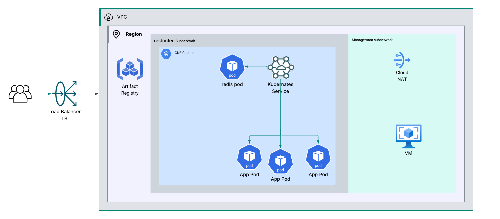

# 🌐 GCP Final Project: Secure Private GKE Deployment with Public Load Balancer

## 🚀 Project Overview

This project demonstrates how to build a secure, production-grade infrastructure on **Google Cloud Platform (GCP)** using **Terraform**. The architecture includes:

- A custom **VPC** with two private subnets (Management & Restricted).
- A **private GKE cluster** in a restricted subnet with **no internet access**.
- A **private VM** in the management subnet used for administration and CI/CD.
- A **Cloud NAT gateway** for controlled egress from the management subnet.
- A **custom GCP service account** for the GKE nodes (not using the default compute SA).
- All Docker images are built and pulled from a private **Artifact Registry**.
- A **public HTTP Load Balancer** is used to expose services on GKE to the internet.
- Only the **management subnet** has access to the GKE cluster (authorized network).

> 🔒 Bonus: Authorized network rules are applied to restrict GKE master access.

---
## 🧱 Architecture Diagram


## 📁 Project Structure

```bash
GCP-final-project/
│
├── app/                 
├── images/               
├── manifasts/            
├── terraform/          
├── .gitignore
└── README.md             
```
## 🧱 Infrastructure Setup

```bash
cd terraform
terraform init
terraform apply
```

## 👨‍💻 VM Access (via IAP)
The management VM is private and only accessible through **Identity-Aware Proxy (IAP)**

```bash
gcloud compute ssh shaimaa-private-vm \
  --zone=europe-west6-a \
  --project=level-agent-460100-t6 \
  --tunnel-through-iap
```
### 🐳 Docker Permissions on the VM
Add current user to the Docker group
```bash
sudo usermod -aG docker $USER
newgrp docker
```
### ☁️ Installing Google Cloud SDK & GKE Auth Plugin
Option 1: Direct download and install
```bash
curl -O https://dl.google.com/dl/cloudsdk/channels/rapid/downloads/google-cloud-sdk-460.0.0-linux-x86_64.tar.gz
tar -xf google-cloud-sdk-460.0.0-linux-x86_64.tar.gz
./google-cloud-sdk/install.sh
source ~/.bashrc
gcloud components install gke-gcloud-auth-plugin
```
Option 2: Install via APT
```bash
echo "deb [signed-by=/usr/share/keyrings/cloud.google.gpg] http://packages.cloud.google.com/apt cloud-sdk main" | \
  sudo tee -a /etc/apt/sources.list.d/google-cloud-sdk.list

curl https://packages.cloud.google.com/apt/doc/apt-key.gpg | \
  sudo apt-key --keyring /usr/share/keyrings/cloud.google.gpg add -

sudo apt update && sudo apt install google-cloud-sdk
```
### 🔗 Connect to GKE Cluster
- Only the management subnet can connect to the GKE cluster.
- Navigate to the GKE cluster on the GCP Console.
    - Click "Connect" and copy the gcloud command.
- Run the command in your private VM terminal
```bash
gcloud container clusters get-credentials shaimaa-private-gke-cluster \
  --zone europe-west6-a \
  --project level-agent-460100-t6
```
### 🐳 Build & Push Docker Images to Artifact Registry
- Python App
```bash
docker build -t europe-west6-docker.pkg.dev/level-agent-460100-t6/shaimaa-app-repo/python-app:latest .
docker push europe-west6-docker.pkg.dev/level-agent-460100-t6/shaimaa-app-repo/python-app:latest
```
- Redis Image
```bash
docker pull redis
docker tag redis europe-west6-docker.pkg.dev/level-agent-460100-t6/shaimaa-app-repo/redis:latest
docker push europe-west6-docker.pkg.dev/level-agent-460100-t6/shaimaa-app-repo/redis:latest
```
### 📦 Kubernetes Deployment
```bash
kubectl apply -f redis.yaml
kubectl apply -f python-deployment.yaml
kubectl apply -f ingress.yaml
```
> Ensure Ingress is backed by a GCP Load Balancer and configured with proper backend services.

### 🌐 Public Load Balancer
After applying the ingress, you’ll receive an external IP. You can use this IP to access your app publicly via HTTP.

